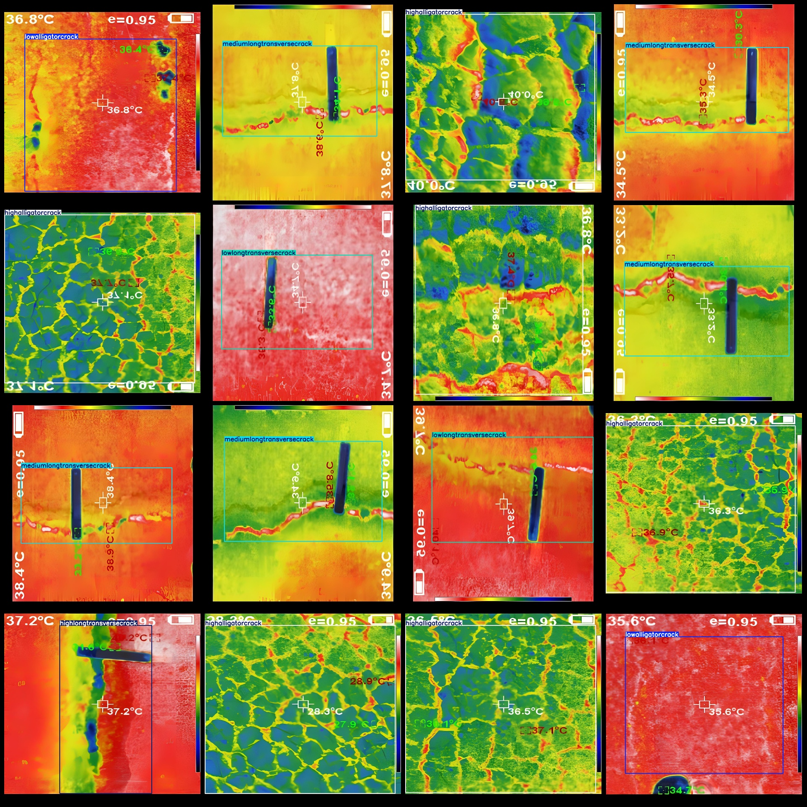
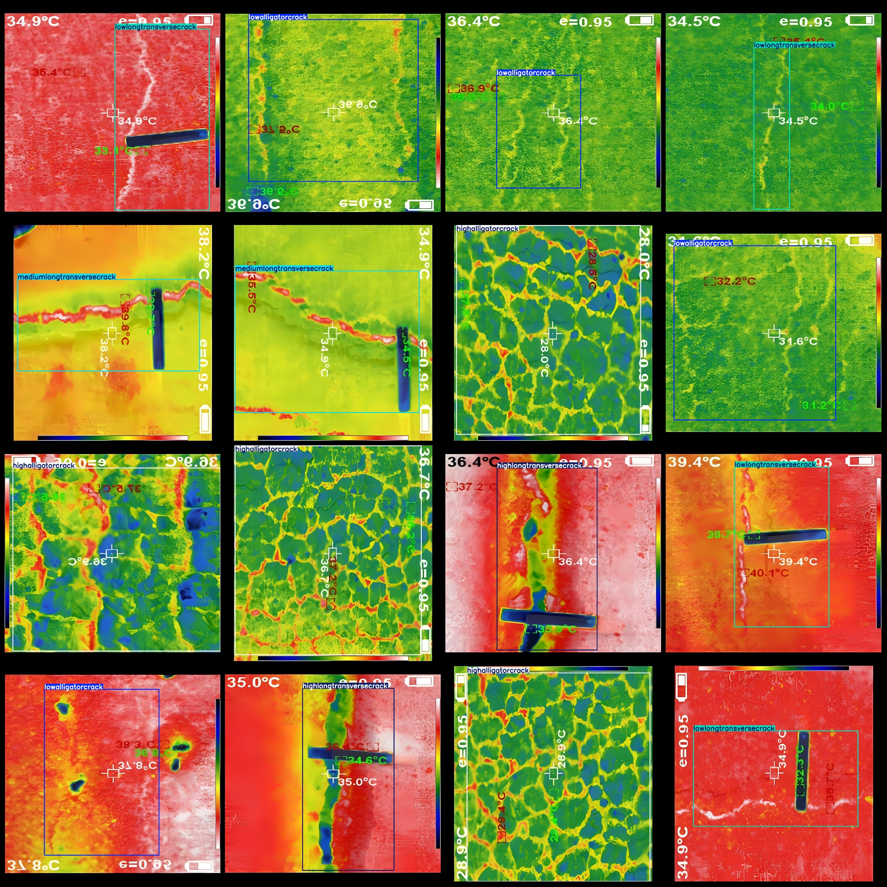

# Infrared Thermal Imaging Road Surface Crack Severity Detection Dataset VOC+YOLO Format with 3437 Images in 6 Categories

Please note that in the dataset, approximately 1400 images are original images, and the remaining are enhanced images.
The format of the dataset is Pascal VOC format + YOLO format (the txt file does not contain the split path, only contains the jpg image and the corresponding VOC format xml file and YOLO format txt file).
number of images: 3437。
annotation count: 3437。
annotation count: 3437。
annotationnumber of classes: 6。
Annotation class names: ["highalligatorcrack", "highlongtransversecrack", "lowalligatorcrack", "lowlongtransversecrack", "mediumalligatorcrack", "mediumlongtransversecrack"]
boxes per class: 
High Alligator Crack (Severe Scale Crack) Box Count = 819, Images = 819.
High Long Transverse Crack (Severe Longitudinal Crack) Box Count = 280, Images = 280.
Low Alligator Crack (Mild Scale Crack) Box Count = 954, Images = 954.
Low Long Transverse Crack (Mild Longitudinal Crack) Box Count = 298, Images = 298.
Medium Alligator Crack (Moderate Scale Crack) Box Count = 364, Images = 364.
Medium Long Transverse Crack (Moderate Longitudinal Crack) Box Count = 722, Images = 722.
total boxes: 3437。
image resolution: 1280x1280。
Use the annotation tool: labelImg.
Annotation rules: draw a rectangle around the class.
Important notes: The dataset does not have been split into training, validation, and test sets, so you need to do that yourself.
Special statement: This dataset does not guarantee any accuracy for the trained models or weight files.
Image preview:
## Images

Here is a pay link on Stripe ( https://buy.stripe.com/3cs8yP7sY87d0vu9AB ). Please contact me lonlonago@foxmail.com after funding $89, and I will send you a complete data files , thank you!

